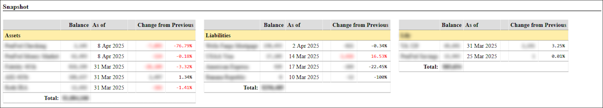

# Personal Finance Tracker
Custom financial tracking and budgeting dashboard

## Background
I spent years of frustration using free and commercial personal finance apps: MS Money, Mint, Quicken, Monarch.  All of them had a lot of great features, but none of them were perfect and most of them couldn't reliably pull data from my financial institutions. So I decided to write my own. For now, this still has a lot of manual processes - but these early efforts are getting the core backend and dashboard in place.

:warning: Please note this repo does not yet contain the full suite of code, db schemas, etc. Maybe someday, but I never really intended this to be public; so the code is an embarrasing mess and contains a ton of personal banking info. At the very least, though, I want to get enough published to be an inspiration to other DIYers.

## What You'll Need
- PHP
- a database (I use MySQL)
- some third party libraries for styling, graphs, and charts
  - [jQuery](https://jquery.com/)
  - [DataTables](https://datatables.net/)
  - [canvasJS](https://canvasjs.com/)
  - [Handsontable](https://handsontable.com/)
- a lot of time and patience to customize to your needs

## My Approach
... in progress ...

- display, layout, printing
- security

### Database
My primary financial instituions (bank and credit cards) thankfully support data export to CSV, so the first step is ingesting that data into a single, unified table:
```sql
CREATE TABLE `exp_track` (
  `id` int NOT NULL AUTO_INCREMENT,
  `src` varchar(20) NOT NULL,
  `date` date NOT NULL,
  `descr` varchar(100) NOT NULL,
  `cat` enum('DINING','BILLS','GROCERIES','FUEL','INCOME','CHARITY','CCPAYMENTS','MORTGAGE','MEDICAL','SHOPPING','ENTERTAINMENT','TRAVEL','INTEREST','DOG','UNCAT') DEFAULT NULL,
  `amt` decimal(10,2) NOT NULL,
  `importdate` timestamp NOT NULL DEFAULT CURRENT_TIMESTAMP,
  PRIMARY KEY (`id`),
  KEY `CAT_IDX` (`cat`),
  KEY `DATE_IDX` (`date`),
  FULLTEXT KEY `DESCR_IDX` (`descr`)
);
```
The `src` column (which I should make an enum) represents where the transaction is from.  I have values here like `checking`, `visa`, etc. The `cat` column (not all my own values shown) are transaction categories. Making that enum helps me enforce the data quality later when I run the categorizations on imported transactions.

For most of those `cat` categories, I have separate tables for each which I later use for each transaction. For example:
```sql
CREATE TABLE `cats_groceries` (
  `descr` varchar(100) NOT NULL
);
```
And that just has a list of substrings (in uppercase) that I will check for during import (e.g. 'GIANT FOOD','SAFEWAY','FOOD LION')  If a transaction description in `EXP_TRACK` contains one of those values, the transaction is categorized as 'GROCERIES'.

### Import Process
There is a separate screen to initiate the import process.  I take a CSV export from a given financial institution and upload it via a regular `multipart/form-data` FORM. That form also specifies which source the import is from, since each institution has a slightly different column order. Data is imported via MySQL `LOAD DATA` into the main `EXP_TRACK` table.

Once all data is imported, the main "Spending Reports" and "Household Budget" sections of the dashboard are immediately updated and viewable. [See the section below](#spending-reports) for a further breakdown of how the data is used to generate these sections.

### Snapshot Totals and Balance Totals Trends
Independent of the data just imported, the top "Overview" section of the dashboard represents snapshots of my financial picture from various institutions. Figures like, "what was the balance on my checking account at the time of the most recent statement." I capture these amounts, categorized by asset or liability, and track them for trend analysis. Data is stored in the following table:
```sql
CREATE TABLE `snapshots` (
  `id` int NOT NULL AUTO_INCREMENT,
  `type` enum('assets','expenses') NOT NULL,
  `source` enum('checking','401k','mortgage','visa','529') NOT NULL,
  `date` date NOT NULL,
  `amount` mediumint NOT NULL,
  PRIMARY KEY (`id`)
);
```
Again, INSERTs to this table are still a very manual process.  Figures like a statement balance aren't included in transaction CSVs.



Once a have a full month of snapshot data, I run a series of queries to populate a `SNAPSHOT_TOTALS` table.  These monthly totals are then used to feed the "Balance Totals Trends" line graph.
```sql
CREATE TABLE `snapshot_totals` (
  `id` int NOT NULL AUTO_INCREMENT,
  `date` date NOT NULL,
  `amt_assets` mediumint NOT NULL,
  `amt_assets_filtered` mediumint NOT NULL,
  `amt_income_total` mediumint NOT NULL,
  `amt_expenses` mediumint NOT NULL,
  `amt_expenses_filtered` mediumint NOT NULL,
  `amt_expenses_total` mediumint NOT NULL
  PRIMARY KEY (`id`)
);
```
More manual processes for now!  To populate this table, I run the following queries. First, this query gets the total assets or expenses from `SNAPSHOTS` for the previous month.  (I run this on the 1st.)
```sql
select sum(amount) as total
from (
 select a.source, a.amount as amount, a.date
     from snapshots a
     where a.type = 'expenses' and a.date = (select max(d.date) from snapshots d where d.source = a.source and d.date <= '2025-03-01') 
     group by a.source
) as results
```
For the example query above here, I would enter that result total into `SNAPSHOT_TOTALS.AMT_EXPENSES` where date = 2025-03-01. I use phpMyAdmin for a lot of this since the gui already has quick edit-in-place capabilities.

Next, I run an almost identical query as before, but filter out a few of the sources:
```sql
SELECT SUM(amount) AS total
FROM (
    SELECT a.source, a.amount AS amount, a.date
    FROM snapshots a
    WHERE a.type = 'assets' 
      AND a.source not in ('401k','mortgage')
      AND a.date =(SELECT MAX(d.date) FROM snapshots d WHERE d.source = a.source AND d.date <= '2025-03-01')
    GROUP BY a.source
) AS results
```
In doing so, I get visibility into a more granular financial picture without large items like my regular mortgage payments or my running 401k balance.  As before, that result total is inserted into the respective column in `SNAPSHOT_TOTALS` for filtered assets or expenses for the given date.

Finally, each month I run the following two queries to provide total assets and expenses amounts for the month.  These pull directly from the main `EXP_TRACK` table, and provide a monthly look at trend totals. (Granular expense tracking is already available following the main imports previously documented.)
```sql
-- income
select round(sum(inc))
from
(   SELECT sum(amt) * -1 as inc FROM `exp_track` et where date like '2025-02%' and cat = 'INCOME' and descr not like 'ONLINE PAYMENT%' and descr not like 'FUNDS TRANSFER%'
    union
    SELECT sum(amt) as inc FROM `mm_track` mt where date like '2025-02%' and amt > 0
) allt
-- expenses
SELECT round(sum(amt)) FROM `exp_track` where date like '2025-02%' and cat <> 'CCPAYMENTS' and amt > 0
```
The total from the first query is added to `SNAPSHOT_TOTALS.AMT_INCOME_TOTAL` for the respective month.  The second query goes to `AMT_EXPENSES_TOTAL`.


### Spending Reports
Enough with the manual processes! Once the initial imports are done, everything on the dashboard beyond the "Overview" section is immediately updated and viewable.  (See the [full dashboard screenshot](#screenshots) below.)  This includes the following:

#### Monthly Spending By All Categories
This is simply a DataTable fed by the following query:
```sql
select 
    CONCAT(year(date),'-',lpad(month(date),2,'0')) as DATE, 
    CONCAT(UCASE(LEFT(cat, 1)),LCASE(SUBSTRING(cat, 2))) as CATEGORY, 
    sum(amt) as TOTAL 
from exp_track 
where cat is not null 
  and cat not in ('INCOME','CCPAYMENTS')
group by CONCAT(year(date),'-',lpad(month(date),2,'0')), cat 
order by year(date) desc, month(date) desc, total desc
```
In the UI, clicking a category creates a popup that displays all transactions for that month and category.

#### Last Month's Spending by Major Categories
Next is a pie chart generated by canvasJS using the following query.  Notice I also filter out categories that I don't want here.
```php
$catsToIgnore = array('APPLE','BILLS','CCPAYMENTS','CHARITY','DOG','FUEL','INCOME','INTEREST','MORTGAGE','PAYPAL','PERSONALCARE');
$query = "
    select 
        CONCAT(UCASE(LEFT(cat, 1)),LCASE(SUBSTRING(cat, 2))) as CATEGORY, 
        sum(amt) as TOTAL 
    from exp_track 
    where cat is not null 
      and cat not in ('" . implode("','",$catsToIgnore) . "')
      and (date >= DATE_FORMAT(CURRENT_DATE - INTERVAL 1 MONTH, '%Y/%m/01') AND date < DATE_FORMAT(CURRENT_DATE, '%Y/%m/01')) 
    group by CONCAT(year(date),'-',lpad(month(date),2,'0')), cat 
    order by year(date) desc, month(date) desc, total desc";
```

#### Monthly Spending Trends by Major Categories
This line graph represents spending by category over the past two years.  It's also generated by canvasJS using the following query.
```sql
select year(date) as YEAR, month(date) as MONTH, CONCAT(UCASE(LEFT(cat, 1)),LCASE(SUBSTRING(cat, 2))) as CATEGORY, sum(amt) as TOTAL 
from exp_track
where cat is not null 
  and date > CURRENT_DATE - INTERVAL 2 YEAR 
  and date < DATE_FORMAT(CURRENT_DATE, '%Y-%m-01') 
group by CONCAT(year(date),'-',lpad(month(date),2,'0')), cat order by upper(cat) asc, year(date) asc, month(date) asc
```
Like before, I ignore some categories here, but I do that when PHP generates the chart data for canvasJS.  Like other line graphs here, the user can click a series in the legend to toggle visibility.

#### Average Spending by Categories
The next table and pie chart are sourced by effectively the same query; the pie chart data filters out a few other specific categories, though.  "Monthly Average Spending by Category" is a regular HTML table and "Average Spending by Major Categories" is a canvasJS pie chart. The pie chart query is:
```sql
$query = "
    select 
        CONCAT(UCASE(LEFT(tbl_totals.category, 1)),LCASE(SUBSTRING(tbl_totals.category, 2))) as CATEGORY, 
        round(avg(tbl_totals.TOTAL),2) as MONTHLY_AVERAGE 
    from (
        SELECT YEAR(DATE) AS YEAR, MONTH(DATE) AS MONTH, cat AS CATEGORY, SUM(amt) AS TOTAL 
        FROM exp_track 
        WHERE cat IS NOT NULL 
          and cat not in ('" . implode("','",$catsToIgnore) . "')
        GROUP BY CONCAT(year(date),'-',lpad(month(date),2,'0')), cat) as tbl_totals 
    group by tbl_totals.category
    order by MONTHLY_AVERAGE desc";
```

## Household Budget

## Personal Limitations
- import workarounds due to hosting provider

## Screenshots
Full screen:


## To Dos to Consider
- purge scheme (data over x years old)
- more/better automation
- improve txn categorization during import
